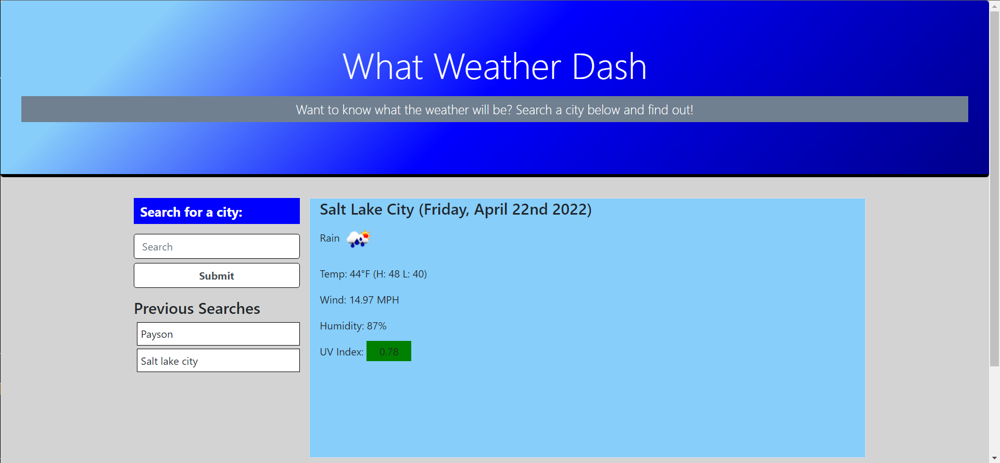

# what-weather-dash
  
## Purpose
A website that will allow a user to search multiple cities for a current and forcast weather conditions so they can plan accordingly.

## Built With
* JavaScript
* HTML
* CSS
* Third party api (https://openweathermap.org/)

## Screenshot

## Website
https://vrentadax.github.io/what-weather-dash/

## Contribution
Made with ❤️ by Dax
